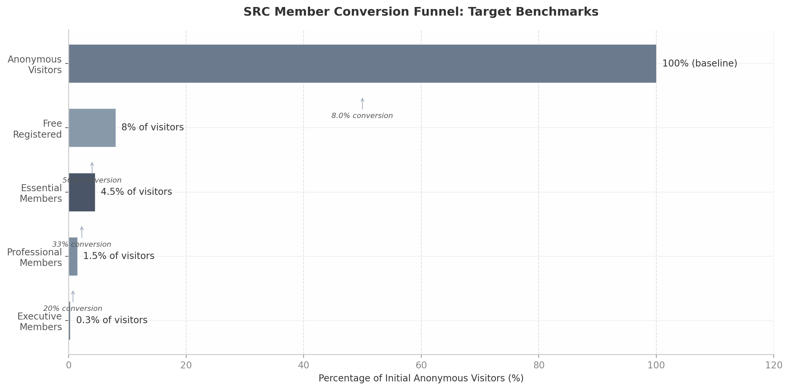

## 5. Newsletter & Briefing Strategy

Newsletters are not a distribution channel for SRC — they are the primary product surface through which members experience value daily. The Financial Times found that newsletter access is "one of the key reasons readers decide to stick with the Premium subscription" despite costing several hundred dollars more annually [^650^]. The New York Times' The Morning reaches 17 million free subscribers and converts 42% to paid plans within six months by strategically triggering paywalls on linked articles [^664^]. For SRC, this means newsletter architecture must be designed as a tiered value ladder where each upgrade unlocks meaningfully different information products — not simply "more of the same."

### 5.1 Newsletter Architecture

#### 5.1.1 Free Tier: "SRC Daily Brief"

The free-tier newsletter serves dual purposes: habit formation and quality demonstration. Research across B2B intelligence publishers confirms the "magic ratio" of free-to-paid content is 3:1 [^720^]. The SRC Daily Brief should publish Monday-Friday mornings (8-10 AM recipient timezone, Tuesday-Thursday being peak engagement days) [^704^] with a five-section structure: a lead original insight of 2-3 paragraphs; four to five curated items with one-line SRC context each; one data point with brief interpretation; a preview of upcoming SRC publications; and a paid conversion CTA. This hybrid model mirrors the NYT The Morning format, which increased average read time by 4.2 minutes versus link-only newsletters [^664^]. The newsletter itself remains free, but linked deep-dive content hits a soft paywall after three articles — embodying the principle that "if this is free, I wonder what's behind the paywall" [^410^].

#### 5.1.2 Essential+: "SRC Weekly Deep-Dive" and "SRC Signal"

Essential members unlock two additional newsletter products. The SRC Weekly Deep-Dive is original long-form analysis of 1,500-2,500 words published every Saturday, subscriber-only — following the Stratechery model where Ben Thompson publishes 2,000+ word analyses behind a paid wall, demonstrating that long-form works when expertise is unavailable elsewhere [^435^]. The NYT found that "subscribers who receive at least one of the subscriber-only newsletters in the portfolio retain better than those with free newsletters" [^663^], with subscriber-only products requiring full narrative pieces, specific topical focus, and community elements [^665^]. The second product is SRC Signal — a topic-filtered alert newsletter allowing members to select from geopolitics, defense, cybersecurity, economic security, or energy/climate verticals, delivering when developments occur in their chosen focus areas.

#### 5.1.3 Professional+: "SRC Forecast" and "Behind the Scenes"

Professional members receive two exclusive newsletter products demonstrating methodological transparency and forward-looking capability. SRC Forecast publishes quarterly scenario analysis examining three plausible futures for major geopolitical or security issues over 12-24 month horizons, with probability assessments and indicator tracking — addressing the premium-tier demand for forward-looking analysis over backward-looking reporting [^653^]. Behind the Scenes exposes SRC's methodology, source evaluation criteria, and analytical reasoning, building trust through the "AI Disclosure Trust Premium" effect where visible AI-to-analyst-to-publication pipelines signal rigor rather than corner-cutting [^711^]. Professional newsletters include audio versions via AI narration at near-zero marginal cost — 48% of Americans consume spoken-word audio daily, with publishers like Berlingske reporting 50% completion rates for narrated subscriber articles [^689^] [^691^].

#### 5.1.4 All Tiers: Customization and Personalization

Every tier, including free, offers customizable topic preferences, regional focus selection (Europe, Asia-Pacific, Americas, Middle East), and frequency control. FT's FirstFT operates three regional editions for timezone-optimized delivery [^142^] — SRC should replicate this. Well-executed segmentation delivers 50% higher click-through rates [^701^], and publishers using AI-powered dynamic content curation report 41% revenue increases from email [^701^]. For MVP, SRC should implement a preference center allowing geographic focus, topic preferences, frequency (daily brief, weekly digest, or both), and format preference — demonstrably reducing unsubscribes by giving readers control [^709^]. Personalization should mature progressively: basic industry/title segmentation → behavioral tracking → predictive targeting → account-based personalization for corporate memberships.

| Newsletter Product | Free | Essential | Professional | Executive |
|:---|:---|:---|:---|:---|
| SRC Daily Brief (Mon-Fri) | ✓ (lead insight + curated items + CTA) | ✓ | ✓ | ✓ |
| SRC Weekly Deep-Dive (Sat) | Preview only (first 40%) | ✓ Full access | ✓ Full access | ✓ Full access |
| SRC Signal (topic alerts) | — | ✓ (1 topic) | ✓ (3 topics) | ✓ (unlimited) |
| SRC Forecast (quarterly) | — | — | ✓ | ✓ + exclusive briefing |
| Behind the Scenes | — | — | ✓ | ✓ |
| SRC Alert (breaking news) | Weekly digest only | 250-500 word updates | 150-250 word newsbreaks | <100 word flash alerts |
| Audio versions | — | Daily Brief only | All newsletters | All + podcast interviews |
| Archive access | Last 30 days | Last 6 months | Last 2 years | Full (founding) |
| Custom topic filters | — | 1 region + 1 topic | 2 regions + 3 topics | Unlimited + watchlists |

The table above reveals a deliberate content-format progression designed to make each tier upgrade feel substantively different rather than merely incremental. Free subscribers receive curated intelligence with original framing; Essential members unlock depth through long-form analysis and topic filtering; Professional members gain methodological transparency and forward-looking scenario work; Executive members access real-time alerts and personalized intelligence services. This architecture follows the "Content Format Taxonomy" principle: tier by format type rather than arbitrary volume limits, because format inherently signals value — opinions are quick takes, reports are structured analysis, studies are comprehensive research, and briefings are interactive intelligence [^435^]. The 3:1 free-to-paid content ratio applies specifically to the Daily Brief: for every one piece that links to paywalled content, three pieces should be fully accessible. B2B newsletters command $25-100+ monthly [^636^], and the newsletter portfolio must justify this pricing through clear format differentiation.

### 5.2 Breaking News Alert System

#### 5.2.1 Five-Tier Alert Hierarchy

Breaking news delivery speed functions as a precise tier differentiator that costs little to implement but creates powerful upgrade incentives. In security and resilience, speed is mission-critical — a corporate security chief will pay premium prices for a guaranteed four-hour analyst response [^656^]. SRC's five-tier alert hierarchy mirrors the intelligence industry standard: GCTI reserves real-time flash alerts for its SOVEREIGN tier ($9,970/year), RANE Worldview delivers daily briefs only to Essential+ subscribers, and Control Risks ONE provides 24/7 analyst-validated alerts exclusively to enterprise clients [^208^] [^59^] [^675^]. The hierarchy maps directly to tiers: Flash Alerts (Executive only, under 100 words, SMS+push, 5-15 minutes); Newsbreaks (Professional+, 150-250 words, 15-30 minutes); Updates (Essential+, 250-500 words, 30-60 minutes); Analysis (all paid, 500-800 words, 2-12 hours); and Weekly Roundup (all tiers, Friday AM).

| Alert Tier | Word Count | Delivery Time | Channels | Eligible Tiers | Example Trigger |
|:---|:---|:---|:---|:---|:---|
| Flash Alert | <100 words | 5-15 min | SMS + push + email | Executive only | Major military engagement, critical infrastructure attack |
| Newsbreak | 150-250 words | 15-30 min | Push + email | Professional+ | Sanctions regime change, significant cyber incident |
| Update | 250-500 words | 30-60 min | Email + dashboard | Essential+ | Policy shifts, emerging threat indicators |
| Analysis | 500-800 words | 2-12 hours | Email + portal | All paid | Full incident assessment with scenario implications |
| Weekly Roundup | Variable | Friday AM | Email | All tiers | Cross-domain synthesis and trend identification |

The alert hierarchy creates a "Breaking News Speed Ladder" where each tier upgrade meaningfully accelerates information access. Flash Alerts follow Reuters journalism standards: filed at priority one, present tense, upper case, containing only verified facts with source attribution — no analysis or speculation [^653^]. The critical discipline is restraint: Reuters explicitly warns against flooding subscribers with excessive alerts, instructing journalists to "think twice if you are filing more than about five alerts on a single newsbreak" because clients complain about screen clutter [^653^]. SRC should enforce a hard cap of three Flash Alerts per week for Executive members to preserve their signalling value — unlimited alerts that are rarely used carry more psychological weight than frequent alerts that train recipients to ignore them.

#### 5.2.2 AI-Human Hybrid Signal-to-Alert Pipeline

Speed without accuracy destroys trust. SRC should implement an AI-human hybrid pipeline processing signals in under 25 minutes with a 3% error rate, matching Seerist's Control Risks partnership benchmarks (6.8 million OSINT sources monitored, 200+ analyst-validated events) [^656^] [^658^]. The five-stage pipeline runs: automated AI detection flags events in under five minutes; analyst triage confirms significance and assigns tier priority in 5-10 minutes; initial Flash Alert with verified facts in 10-15 minutes; context brief with implications in 30-60 minutes; and full multi-source analysis in 2-24 hours. Human validation is non-negotiable — the Reuters standard mandates "a second pair of eyes" for accuracy and fairness [^653^]. AI fact-checking reduces headline errors from 15% to 3%, but final editorial judgment must remain human [^711^].

#### 5.2.3 Alert Fatigue Prevention

Alert fatigue is the single greatest threat to a breaking news system's effectiveness. Push notification research reveals a paradox: while 3-6 irrelevant pushes per week cause 40% of users to disable notifications, more than 20 relevant messages cause minimal opt-outs [^651^]. Relevance matters 300-400% more than volume — targeting improves reaction rates by 300% and personalization by 400% [^651^]. SRC should set a default maximum of three push alerts per week, with members filtering by topic, region, and severity. B2B audiences are particularly sensitive to signal-to-noise ratio — 73% unsubscribe from notifications due to irrelevant messages, and 52% who disable push notifications eventually churn entirely [^657^]. Weekend protocols should follow the Control Risks model: Critical events trigger 24/7/365 push+SMS+phone escalation; High events trigger push+SMS after hours; Medium and Low events batch into the next digest [^675^] [^700^].

---

## 6. Member Journey & Conversion Funnel

The difference between a thriving membership business and a struggling one often comes down to a single metric: stop rate. Publishers with stop rates above 6% had "thriving" digital subscription businesses, while the median publisher stopped only 1.8% of readers [^1045^] [^1046^]. Yet 68% of readers view only one article in a 30-day period, and 23% view just two to five — meaning generous content meters miss most of the audience entirely [^1042^]. SRC's funnel must be architected around one counterintuitive principle: tight gates encountered early convert dramatically better than generous gates encountered rarely. Salem Reporter's registration wall after one article generated 16 times more signups than in-content newsletter forms, and 20% of those registered users eventually converted to paid subscribers [^965^] [^966^]. Piano's benchmark data puts the magnitude in stark terms: anonymous visitors convert at 0.22%, while known registered users convert at 9.88% — a 45-fold difference [^1041^].

### 6.1 Funnel Architecture

#### 6.1.1 Anonymous to Free: The Registration Wall

SRC should implement a registration wall (requiring email and password, not just email) after three articles — tight enough to capture engaged visitors while preserving discoverability. Social proof on the registration modal ("2,000+ security professionals read SRC weekly") builds credibility. Piano research confirms registered users convert to paid subscribers at 10 times the rate of anonymous visitors [^969^], and The Telegraph saw registration requirements triple daily subscriber acquisition [^969^]. The i-Paper found registered users were 30 times more likely to subscribe after implementing Piano's Likelihood to Subscribe model, yielding a five-fold conversion increase [^1040^]. The principle is clear: if average visitors read only 1.7-1.8 articles per session, a meter set at 5+ means most traffic never sees any conversion prompt [^965^]. SRC's three-article threshold is the single highest-ROI architectural decision in the entire funnel.

#### 6.1.2 Free to Essential: Usage Triggers and Contextual Gates

Once registered, free members encounter strategic friction points at moments of peak engagement. Contextual upgrade prompts convert three to five times higher than generic buttons — Notion's contextual gates convert at 4.2% versus 1.3% for generic prompts [^156^]. SRC should deploy four triggers: a usage limit warning approaching the article cap ("90% of free reports used"); a PDF download gate requiring Essential membership; exclusive content previews showing the first 40% of Professional-tier analysis; and behavior-triggered prompts (repeated topic visits, high time-on-page, breaking news engagement). Users who hit usage limits convert at approximately 40% versus 8% who never hit limits [^1016^]. Progressive engagement gates at 85% of the limit convert three to five times higher than hard gates [^156^], yet 70% of free users never encounter prompts or dismiss them reflexively. Most conversions happen within 30 days of signup or 7 days of hitting a meaningful limit [^989^].

#### 6.1.3 Essential to Professional: Feature Gates and Experience Teasing

The Essential-to-Professional transition requires demonstrating capabilities members have come to need but cannot access. The upgrade triggers at 70% usage of Essential features — following the "70% Rule" (give away 70% of value, gate the remaining 30% plus power features) [^1016^]. SRC deploys four mechanisms: a feature gate at 70% usage with Professional preview; a vAvatar (AI video briefing) preview where Essential members watch 60 seconds before hitting an upgrade gate; early access teasing showing Professional members receive breaking news 2-4 hours earlier; and annual plan promotion with "2 months free" framing [^1005^]. The vAvatar preview is particularly powerful — it transforms abstract tier differences into tangible experiences. Product Qualified Lead (PQL) based conversion achieves 25-30% versus 2-4% for all freemium users [^1016^]. An SRC PQL means a member reaching an activation milestone (10+ articles read, webinar attended, preferences set), an engagement threshold (3+ weekly visits), and an intent signal (pricing page visited, upgrade clicked).

#### 6.1.4 Professional to Executive: Invitation and Exclusivity

The top-tier conversion cannot be self-service — it requires personal outreach, limited cohort size, and experiential proof. The Conference Board structures its highest tier as Council Membership: peer groups of approximately 40 executives, carefully vetted, operating under Chatham House Rule [^41^]. SRC should adopt a similar invitation model targeting the top 5% of Professional members by engagement, seniority, and organizational influence. The conversion sequence includes: a personal invitation from SRC leadership; a preview invitation to the annual "SRC Summit" in Switzerland; and a 30-minute trial analyst call. On Think Tanks uses progressive tier rollout — launching Essential first, then introducing additional tiers with live webinars and deeper expert engagement, allowing members to "grow with the programme as it evolves" [^416^]. The Executive tier should maintain an application element ensuring cohort quality, because exclusivity is itself the product at this level.

| Funnel Stage | Conversion Trigger | Target Rate | Key Mechanism | Timeline |
|:---|:---|:---|:---|:---|
| Anonymous → Free | 3-article registration wall | 6-8% visitor-to-registered | Social proof + quality demonstration | Immediate |
| Free → Essential | Usage limit + content gate | 3-5% (5-10% aspirational) [^725^] [^967^] | Contextual prompts at 85% usage limit | Within 30 days of signup |
| Essential → Professional | Feature gate at 70% usage | 25-30% PQL-based [^1016^] | vAvatar preview + early access tease | Month 2-4 of subscription |
| Professional → Executive | Personal invitation only | 5-10% of Professionals | Summit preview + analyst call trial | Month 6-12 of engagement |

The funnel architecture reflects a fundamental principle: conversion efficiency increases with engagement depth. The anonymous-to-free stage relies on broad gates and social proof; the free-to-essential stage deploys behavioral triggers at moments of maximum value perception; the essential-to-professional stage uses experiential previews that make abstract tier differences tangible; and the professional-to-executive stage requires human touch because no automated prompt can convey the value of peer-level access. Industry benchmarks confirm this progression: Substack's median paid conversion rate is 3% (not the 5-10% claimed), with only 20% of publications exceeding 5% [^967^]; however, top-performing sites see over 12% conversion from registered users within a year [^1041^]. SRC's target of 3-5% free-to-paid conversion with 5-10% as aspirational is realistic for a B2B intelligence context where professional value drives purchasing decisions. Piano's 2024 benchmarks show average conversion from registered user to subscriber reached 19%, with top performers exceeding 2.2% from anonymous visitor to subscriber [^1039^].

### 6.2 Retention & Expansion Mechanics

#### 6.2.1 Behavioral Onboarding

The first 10-21 days determine whether a member becomes active or dormant. The standard high-performing sequence delivers 5-7 emails over 10-21 days, front-loaded in week one: Welcome, Setup Prompt, Feature Education, First-Milestone Celebration, Social Proof, Trial Warning, and Upgrade CTA [^1062^]. Welcome email open rates range from 50-86%, dropping to 25-40% by the fifth email [^532^] — the first message must arrive within 5 minutes of signup. Critically, behavior-triggered sequences convert three to five times better than time-based drips [^1064^]: if a new member reads three articles on cybersecurity, the next email should highlight SRC's cybersecurity coverage and Signal newsletter; if a member attends a webinar, the follow-up should reference that event. Never send more than two onboarding emails in the first 48 hours [^1062^]. Checklists with 3-5 steps work best — celebrate each completion to build momentum [^1016^]. Slack's re-engagement sequence recovers 22% of drop-offs and improves 14-day retention by 18% [^1015^].

#### 6.2.2 Annual Plan Promotion

Monthly subscribers receive targeted annual plan promotions during month three — after experiencing value but before payment fatigue sets in. The offer should frame as "switch to annual, get 2 months free" rather than a percentage discount [^1005^]. Annual subscribers are three to five times more likely to renew, and year-two renewal rates are meaningfully higher than monthly data would predict [^1005^]. Codecademy's case study demonstrates retention-based pricing power: structuring annual prices around actual cohort retention increased lifetime value by 25-50% and enabled higher acquisition spend [^1005^]. The pricing page should default to annual billing, leveraging the default effect [^1005^]. The most common industry discount is 16.7% (10 months for 12) [^1006^], though optimal sizing varies: short-lifecycle B2C requires 67-79% effective discounts, while long-lifecycle B2B subscriptions require only 0-17% [^1005^]. For SRC's B2B context, an annual price equivalent to 10 months of monthly billing (16.7% discount) represents a reasonable starting point.

#### 6.2.3 Win-Back Campaigns

Not all churn is permanent. Well-executed win-back campaigns recover 10-15% of churned customers at effectively zero acquisition cost [^1010^]. The optimal first touchpoint is 7-14 days after cancellation — too soon feels reactive, too late and emotional connection fades [^1008^]. Campaigns must be segmented by cancellation reason: price-sensitive churners receive discount offers; product-fit churners receive tier-swap offers; no-reason churners receive soft re-introduction highlighting what they are missing [^1008^]. Two to three emails over 2-4 weeks suffice: warm check-in, matched offer, and respectful farewell leaving the door open [^1008^]. Smart cancellation flows with exit surveys, pause offers, and targeted discounts reduce churn by 15-30% before members even leave [^1010^]. The recommended flow: offer pause first, then discount, then a smart survey with conditional logic, and finally remind subscribers what they will lose. Re-churn rate (reactivated subscribers who cancel again within 90 days) must be monitored — a high rate signals offer-driven returns without genuine intent [^1008^].

#### 6.2.4 Key Performance Metrics

Membership health should be tracked through a focused dashboard of leading and lagging indicators. The free-to-paid conversion rate is the primary leading indicator, with 3-5% as the baseline target and 5-10% as aspirational. Independent analysis confirms Substack's median conversion is 3%, with only 20% of publications exceeding 5% [^967^]; B2B newsletters typically outperform consumer content because professional value justifies business expenditure [^636^]. Monthly churn must stay below 5% — publishers using dynamic paywalls average 4.2% monthly churn [^1039^], while consistent high-value newsletters maintain rates as low as 1% [^688^]. Net Revenue Retention (NRR) above 100% indicates that expansion revenue (upgrades, annual conversions) exceeds churn losses; best-in-class B2B SaaS achieves 120-130%+ [^1055^]. The stop rate — the percentage of readers who hit a paywall or gate — should target 6%+ for a thriving business, per the Shorenstein Center's study of 500+ U.S. newspapers [^1045^] [^1046^].

| Metric | Target | Baseline | Source Benchmark | Measurement Frequency |
|:---|:---|:---|:---|:---|
| Free-to-paid conversion | 5-10% | 3-5% [^725^] | Substack median 3%; top 20% exceed 5% [^967^] | Monthly |
| Monthly churn rate | <3% | <5% | PLG strong: <3% [^1021^]; publishers: 4.2% [^1039^] | Monthly |
| Net Revenue Retention | 100%+ | 95%+ | B2B median 100-104%; best-in-class 120-130%+ [^1055^] | Quarterly |
| Stop rate | 6%+ | 3-5% | Thriving publishers: 6%+; median: 1.8% [^1045^] [^1046^] | Monthly |
| Activation rate (7-day) | 65%+ | 33% | Top 10%: 65%+; best-in-class: 80%+ [^1016^] | Weekly |
| Win-back recovery | 10-15% | 5-10% | Best practice: 10-15% at zero CAC [^1010^] | Per campaign |
| Annual plan attach rate | 40%+ | 25% | Annual subscribers 3-5x more likely to renew [^1005^] | Quarterly |

The metrics framework reveals two critical leading indicators that predict downstream performance. Stop rate is the strongest predictor of subscription success — publishers above 6% stop rates consistently build thriving digital businesses, while those at the 1.8% median struggle regardless of content quality [^1045^]. This means SRC must ensure its registration wall, content gates, and upgrade prompts are actually encountered by engaged readers rather than set so generously that most traffic never experiences them. The second leading indicator is 7-day activation rate — the percentage of new members who reach an "aha moment" within their first week. Top-performing platforms achieve 65%+ activation versus an average of 33% [^1016^]. For SRC, the aha moment might be completing a newsletter preference setup, downloading a first report, or attending a live briefing. Members who experience this moment are 5-10 times more likely to convert to paid [^1016^]. Reducing churn by just 5% can double a company's growth rate — for a membership business at scale, the difference between 5% and 2% monthly churn translates to hundreds of thousands of francs in saved acquisition costs and retained revenue annually [^1010^] [^1009^].
